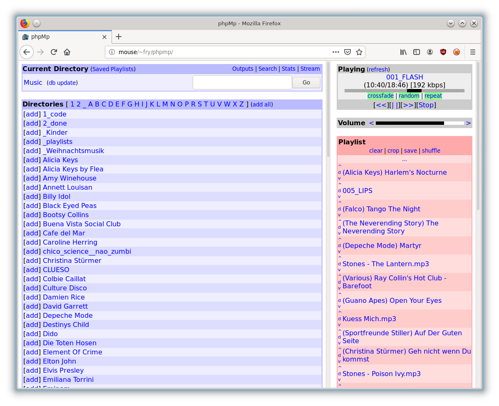
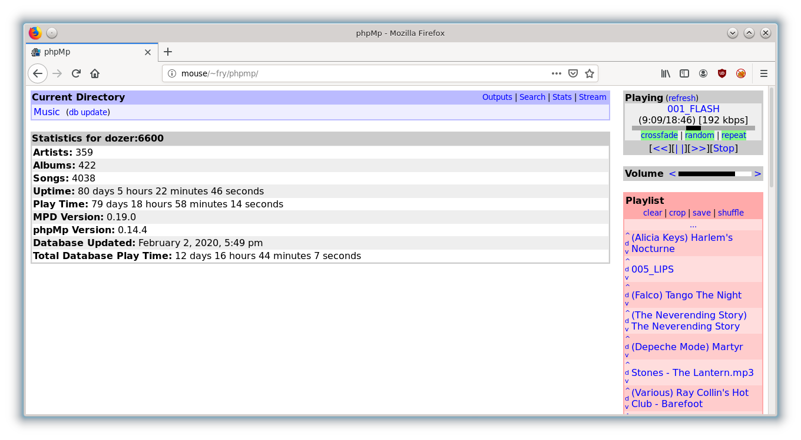
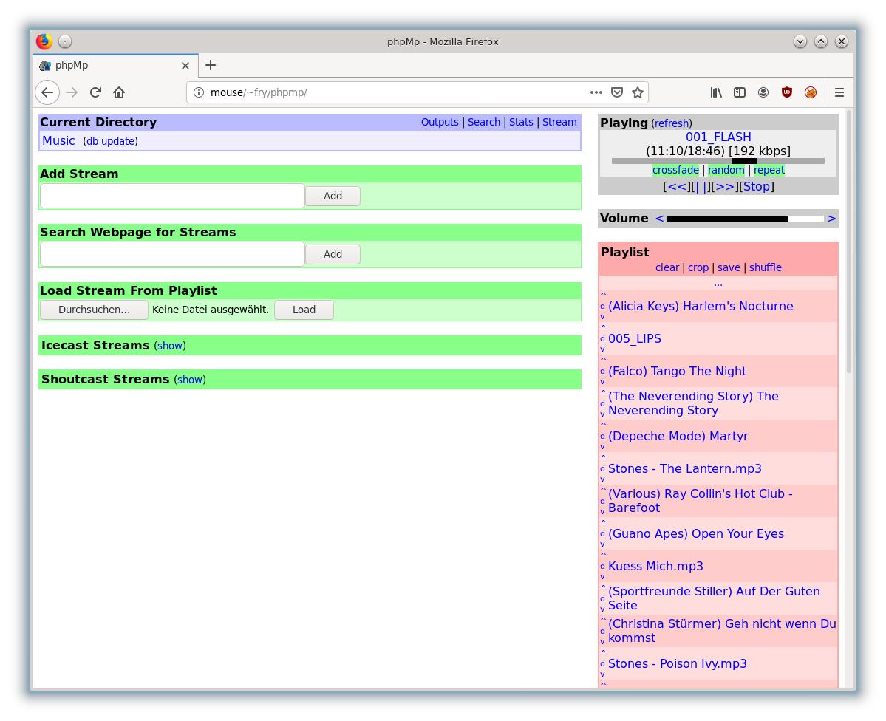

                                    phpMp
                        http://www.musicpd.org

phpMp is a web interface (written in PHP) for the Music Player Daemon (MPD).

To install phpMp, see INSTALL.

current version phpMp[0.14.4] for PHP/7.3
(orig repo https://github.com/tswaehn/phpmp)
Thanks to [Avuton Olrich][Niccolo Rigacci][Warren Dukes][Sven Ginka]

inline=
----------------------------------------------------------------------------

If you want to use phpMp as a search engine in your browser of choice you
obviously need to do a little URL constuction. This is not an issue as 
phpMp makes it pretty simple, here's how to set it up.

The url will take up to three arguments: inline, search and server

* inline would be the search term, this is required.
* search would be anything you have in $search_fields in config.php or any.
	This is optional and defaults to "any".
* server in the case you have more than one server in config.php, ordered
	by number. This defaults to '0'.

In Konqueror you would set this search URL to:
http://myserver/phpMp/index.php?inline=\{@}&search=any&server=0

stream_browser
--------------------------------------------------------------------------

To use the stream browser updating you need to have 'allow_url_fopen' set 
to 'On' in your php.ini. This is required only if you want to be able to 
download and update the file from within phpMp. Otherwise you could have 
it as a cronjob. The stream browser will not show up (at all) unless the
following file(s) exist.

It needs to go into the cache/ directory with the name stream-icy.xml or 
stream-shout.xml, respectively. While I host a shoutcast xml file, which 
updated tri-daily you can generate your own using contrib/shoutcast.pl, 
which could also be setup as a cronjob.

MiniFAQ
-------

Q. Can you put the Playing Song or the Status in the Topic?

A. Yes and no, Of course, it's possible. It won't happen here because
   it would require the full page to reload rather than just the playlist,
   or javascript.

phpMp is released under the GNU Public License.
You should have received a copy of the GNU General Public License
along with this program; if not, write to the Free Software
Foundation, Inc., 59 Temple Place, Suite 330, Boston, MA  02111-1307  USA
For the full license, see COPYING.

Screenshots
----

